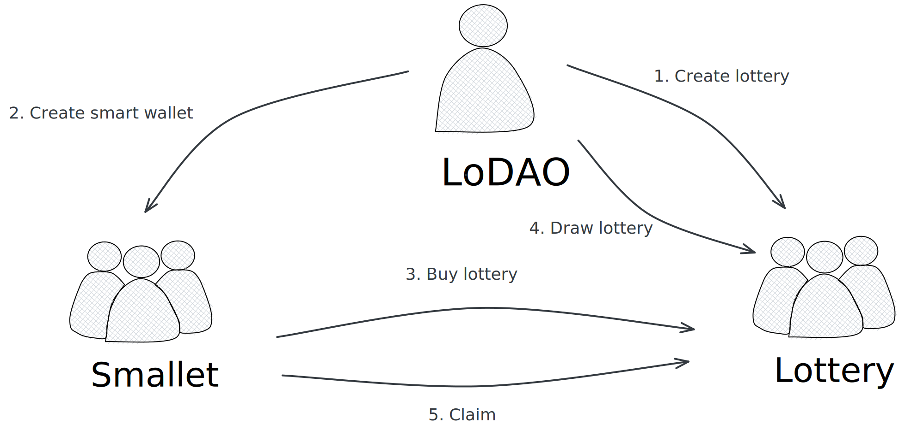

# Lotter Games

This is a game about Staking - Lottery, where anyone can stake any asset to earn profits and, on top of that, have a chance of unexpected rewards, all while enjoying the fun. The most important thing is to have joy and happiness!

## Lottery  Gameplay：

1. Buy:
   Purchase using the native token of the corresponding blockchain. The cost is a fixed amount for each round, and the denominations can be set during the initialization of the Lottery contract. For example: 10 ARCH, 20 ARCH, 50 ARCH, 100 ARCH, 200 ARCH, etc.

2. Draw:
   Regular draws, for instance, at 22:00 (automated through Oracle if possible, manual as an alternative).

3. Prize
   The prize pool for each round is funded by the purchase amounts. the jackpot wins the all funds of the lottery.

4. Period：
   There are three types of Lottery periods: Day (DAY), Month (MONTH), and Year (YEAR). Additional periods like Hour (HOUR) and Week (WEEK) can be added if required.
   
5.  Eligibility: 
    - DAY Lottery: Open to all participants
    - MONTH Lottery: Participants must have participated in 15 previous DAY Lotteries.
    - YEAR Lottery: Participants must have participated in 10 previous MONTH Lotteries or 200 previous DAY Lotteries.

## Use Cases

### Buy `Lottery` ticket

Users can buy tickets for the corresponding lottery from the "Lottery" list. Once the deadline for a "Lottery" is reached, no further bets can be placed. Upon successful betting, users will receive an NFT for the current round.

### Draw `Lottery` 

`Platform` will conduct the draw for each round at 22:00 on the day of the deadline. The winner will be randomly selected from the buyers

### Claim `Lottery` 

After the `Lottery` draw, the winner can claim the prize for the current round. User can withdraw funds from `Lottery` contract and transfer it to another.

### Withdraw `Lottery` funds 

The winner of `Lottery` can withdraw the funds in `Lottery`

### Transfer `Lottery` 

The NFT voucher for purchasing `Lottery` and the winning `Lottery` can be traded.

### Query `Lottery` 

The `Lottery` list is categorized as DAY, MONTH, and YEAR. It can be filtered to show whether the draw has been conducted.

Users can query the play situation for a specific `Lottery`,including the total prize amount, the number of participants, and the winner (if `Lottery` has already drawed).

## Architecture Diagram



## Setup

Assuming you have a recent version of Rust and Cargo installed
(via [rustup](https://rustup.rs/)),
then the following should get you a new repo to start a contract:

Install [cargo-generate](https://github.com/ashleygwilliams/cargo-generate) and cargo-run-script.
Unless you did that before, run this line now:

```sh
cargo install cargo-generate --features vendored-openssl
cargo install cargo-run-script
```

Now, use it to create your new contract.
Go to the folder in which you want to place it and run:

## Create a Repo

After generating, you have a initialized local git repo, but no commits, and no remote.
Go to a server (eg. github) and create a new upstream repo (called `YOUR-GIT-URL` below).
Then run the following:

```sh
# this is needed to create a valid Cargo.lock file (see below)
cargo check
git branch -M main
git add .
git commit -m 'Initial Commit'
git remote add origin YOUR-GIT-URL
git push -u origin main
```

## compile to WASM
in the project directory, run the command:
```sh
cargo wasm
```

## optimizer the wasm
```sh
docker run --rm -v "$(pwd)":/code \
  --mount type=volume,source="$(basename "$(pwd)")_cache",target=/target \
  --mount type=volume,source=registry_cache,target=/usr/local/cargo/registry \
  cosmwasm/workspace-optimizer:0.13.0
```

## Deploy contract to Archway
```sh
# upload the contract wasm file, remember to change your local address
archwayd tx wasm store artifacts/lottery.wasm --from dd --node https://rpc.constantine.archway.tech:443 --chain-id constantine-3 --gas 5000000 --fees 5000000000000000000aconst	
# return tx hash : 5A5FA0ED74F9996B491E68C1D7BF60AA6E28481B8B7E40C765EE9223137B4F4B
# then query the code id: 938 on https://testnet.mintscan.io/archway-testnet/txs/5A5FA0ED74F9996B491E68C1D7BF60AA6E28481B8B7E40C765EE9223137B4F4B

archwayd tx wasm store artifacts/platform.wasm --from dd --node https://rpc.constantine.archway.tech:443 --chain-id constantine-3 --gas 5000000 --fees 5000000000000000000aconst

# instantiate contract
archwayd tx wasm instantiate 939 '{"name":"Fada Lottery", "lottery_code_id":938}' --from dd --node https://rpc.constantine.archway.tech:443 --chain-id constantine-3 --gas 5000000 --fees 5000000000000000000aconst --label testdev --admin archway1pzszxc78dc4k5zs6j3pnuw9w4vmfx276qjsl6n

# return tx hash: 6361C71B70E3F20F7EF1B1252FB341942A19862E23D8711613BFCBB557616BC5 
# and then find the contract address: archway1shq3m5hshsmdqujdj6urq33tl56y2t6v95x3f0ju5z46aqpm7wessmev0m
# on https://testnet.mintscan.io/archway-testnet/txs/6361C71B70E3F20F7EF1B1252FB341942A19862E23D8711613BFCBB557616BC5
```

## CI Support

We have template configurations for both [GitHub Actions](.github/workflows/Basic.yml)
and [Circle CI](.circleci/config.yml) in the generated project, so you can
get up and running with CI right away.

One note is that the CI runs all `cargo` commands
with `--locked` to ensure it uses the exact same versions as you have locally. This also means
you must have an up-to-date `Cargo.lock` file, which is not auto-generated.
The first time you set up the project (or after adding any dep), you should ensure the
`Cargo.lock` file is updated, so the CI will test properly. This can be done simply by
running `cargo check` or `cargo unit-test`.

