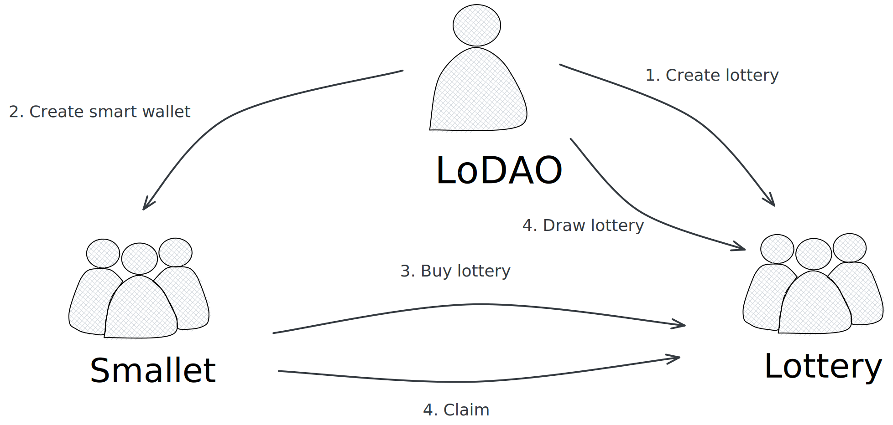

# Lotter Games

This is a game about Staking - Lottery, where anyone can stake any asset to earn profits and, on top of that, have a chance of unexpected rewards, all while enjoying the fun. The most important thing is to have joy and happiness!

## Lottery  Gameplay：

1. Buy:
   Purchase using the native token of the corresponding blockchain. The cost is a fixed amount for each round, and the denominations can be set during the initialization of the Lottery contract. For example: 10 ARCH, 20 ARCH, 50 ARCH, 100 ARCH, 200 ARCH, etc.

2. Draw:
   Regular draws, for instance, at 22:00 (automated through Oracle if possible, manual as an alternative).

3. Prize
   The prize pool for each round is funded by the purchase amounts. 80% of the current round's funds will be used as rewards, 10% will be allocated to the monthly jackpot

4. Period：
   There are three types of Lottery periods: Day (DAY), Month (MONTH), and Year (YEAR). Additional periods like Hour (HOUR) and Week (WEEK) can be added if required.
   
5.  Eligibility: 
    - DAY Lottery: Open to all participants
    - MONTH Lottery: Participants must have participated in 15 previous DAY Lotteries.
    - YEAR Lottery: Participants must have participated in 10 previous MONTH Lotteries or 200 previous DAY Lotteries.

## Use Cases

### Create Smart Wallet (Smallet)

Users can create a smart contract wallet called "Smallet," which serves as a container for all their assets.

### Buy `Lottery` (Betting)

Users can buy tickets for the corresponding lottery from the "Lottery" list. Once the deadline for a "Lottery" is reached, no further bets can be placed. Upon successful betting, users will receive an NFT for the current round.

### Draw `Lottery` 

`LoDAO` will conduct the draw for each round at 22:00 on the day of the deadline. The winner will be randomly selected from the buyers

### Claim `Lottery` 

After the `Lottery` draw, the winner can claim the prize for the current round. If the user hasn't created the smart contract wallet `Smallet`, they will be prompted to do so. If the user chooses to create `Smallet`, they can receive the "Lottery" into it; otherwise, it will be received in the current account.

### Send `Lottery` 

The NFT voucher for purchasing `Lottery` and the winning `Lottery` can be traded.

### Query `Lottery` 

The `Lottery`` list is categorized as DAY, MONTH, and YEAR. It can be filtered to show whether the draw has been conducted.

Users can query the betting situation for a specific `Lottery`,including the total prize amount, the number of participants, and the winner (if `Lottery` has already drawed).

## Architecture Diagram



## Setup

Assuming you have a recent version of Rust and Cargo installed
(via [rustup](https://rustup.rs/)),
then the following should get you a new repo to start a contract:

Install [cargo-generate](https://github.com/ashleygwilliams/cargo-generate) and cargo-run-script.
Unless you did that before, run this line now:

```sh
cargo install cargo-generate --features vendored-openssl
cargo install cargo-run-script
```

Now, use it to create your new contract.
Go to the folder in which you want to place it and run:

## Create a Repo

After generating, you have a initialized local git repo, but no commits, and no remote.
Go to a server (eg. github) and create a new upstream repo (called `YOUR-GIT-URL` below).
Then run the following:

```sh
# this is needed to create a valid Cargo.lock file (see below)
cargo check
git branch -M main
git add .
git commit -m 'Initial Commit'
git remote add origin YOUR-GIT-URL
git push -u origin main
```

## CI Support

We have template configurations for both [GitHub Actions](.github/workflows/Basic.yml)
and [Circle CI](.circleci/config.yml) in the generated project, so you can
get up and running with CI right away.

One note is that the CI runs all `cargo` commands
with `--locked` to ensure it uses the exact same versions as you have locally. This also means
you must have an up-to-date `Cargo.lock` file, which is not auto-generated.
The first time you set up the project (or after adding any dep), you should ensure the
`Cargo.lock` file is updated, so the CI will test properly. This can be done simply by
running `cargo check` or `cargo unit-test`.

