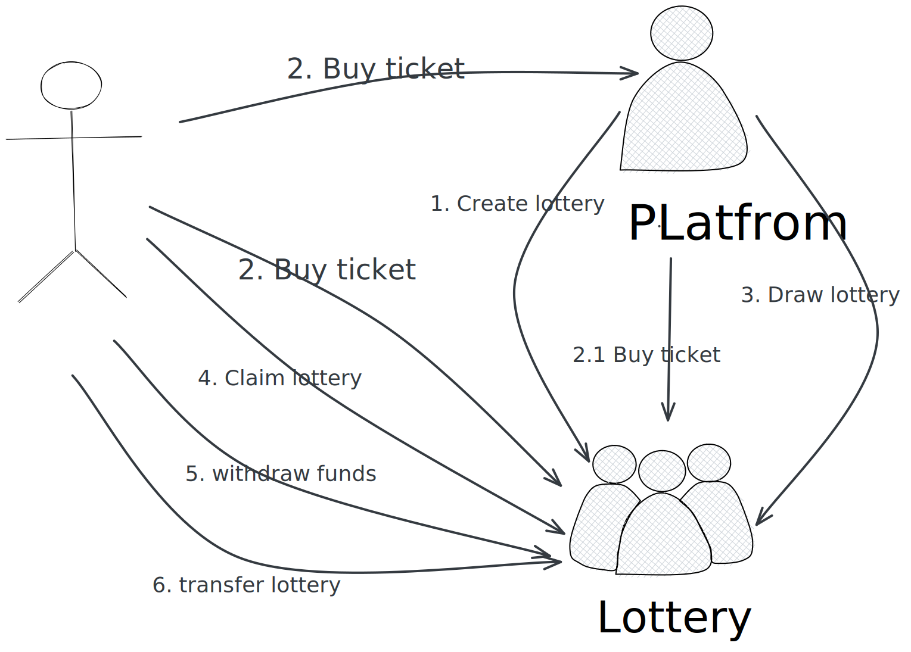

# Lotter Games (乐透)

This is a game about Staking - Lottery, where anyone can stake any asset to earn profits and, on top of that, have a chance of unexpected rewards, all while enjoying the fun. The most important thing is to have joy and happiness!

## **Lottery (乐透)** 玩法：

1. Buy：使用 对应链的 原生 token 购买，费用每期固定金额，面额价格可在初始化 `Lottery` 合约时设定，例如：10 ARCH, 20 ARCH, 50 ARCH, 100 ARCH，200 ARCH 等。

2. Draw：定期开奖，例如 22：00开奖（可通过Oracle，尽量自动，手动备选）

3. Rewards：每期的购买资金就是奖金，当期资金的中的80%是本期奖励，10% 拨入当月大奖的奖金池，10% 拨入年度终极大奖奖金池

4. Period：有 3 种周期的 `Lottery` ： 天 (DAY), 月 (MONTH), 年 (YEAR)，如果需要可以增加 HOUR (小时), WEEK (周)。
   
5. Qualification: 资格
    - DAY Lottery：所有人都能参加
    - MONTH Lottery：累计参加 15 次 DAY Lottery 的人可以参加
    - YEAR Lottery：累计参加 10 次 MONTH 或 200 次 DAY 的人可以参加

## Use Cases

### Create Smart Wallet 创建智能合约钱包 (Smallet)

用户可以创建智能合约钱包 `Smallet`，`Smallet` 是 `Lottery` 中的资产容器

### Buy `Lottery` 投注

用户在 `Lottery` 列表中选择对应的彩票进行购买, `Lottery` 截止时间后不能继续投注，投注成功后，获得当期 NFT

### Draw `Lottery` 开奖

`LoDAO` 在每期截止时间当天的22：00 开奖，随机从购买者中选出获奖者

### Claim `Lottery` 兑奖

`Lottery` 开奖后，中奖者可以领取当期 `Lottery` ，领奖时，如果用户没有创建 智能合约钱包 `Smallet`，可提示用户创建，如果用户选择创建 `Smallet` ，可以把 `Lottery` 领取到 `Smallet`，否则领到到当前账户下。

### Transfer `Lottery` 交易

购买 `Lottery` 的凭证 NFT 可以交易，中奖后的 `Lottery` 也可以交易。

### Query `Lottery` 查询

彩票列表：按DAY, MONTH, YEAR 分类，可过滤是否已开奖

可查询指定 `Lottery` (乐透)投注情况，包括总奖金，参与人(数)，获奖者（如果开奖了）

## Architecture Diagram



## Setup

Assuming you have a recent version of Rust and Cargo installed
(via [rustup](https://rustup.rs/)),
then the following should get you a new repo to start a contract:

Install [cargo-generate](https://github.com/ashleygwilliams/cargo-generate) and cargo-run-script.
Unless you did that before, run this line now:

```sh
cargo install cargo-generate --features vendored-openssl
cargo install cargo-run-script
```

Now, use it to create your new contract.
Go to the folder in which you want to place it and run:

## Create a Repo

After generating, you have a initialized local git repo, but no commits, and no remote.
Go to a server (eg. github) and create a new upstream repo (called `YOUR-GIT-URL` below).
Then run the following:

```sh
# this is needed to create a valid Cargo.lock file (see below)
cargo check
git branch -M main
git add .
git commit -m 'Initial Commit'
git remote add origin YOUR-GIT-URL
git push -u origin main
```

## CI Support

We have template configurations for both [GitHub Actions](.github/workflows/Basic.yml)
and [Circle CI](.circleci/config.yml) in the generated project, so you can
get up and running with CI right away.

One note is that the CI runs all `cargo` commands
with `--locked` to ensure it uses the exact same versions as you have locally. This also means
you must have an up-to-date `Cargo.lock` file, which is not auto-generated.
The first time you set up the project (or after adding any dep), you should ensure the
`Cargo.lock` file is updated, so the CI will test properly. This can be done simply by
running `cargo check` or `cargo unit-test`.

